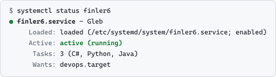
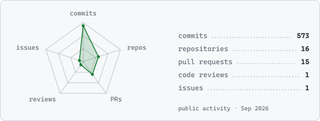

Hi, I'm Gleb. I write C, C# and Python. I did my bachelor's at BUT FIT and I'm now doing my master's there.

<picture>
  <source media="(prefers-color-scheme: dark)" srcset="assets/status-dark.svg">
  
</picture>

<picture>
  <source media="(prefers-color-scheme: dark)" srcset="assets/stats-dark.svg">
  
</picture>
