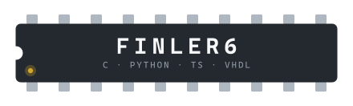

<picture>
  <source media="(prefers-color-scheme: dark)" srcset="assets/chip-dark.svg">
  
</picture>

Hi, I'm Gleb. I mostly write C and Python, sometimes TypeScript, and I like the parts of computers you don't normally see: compilers, packets, registers.

Most public repos here are university projects from BUT FIT. The ones I'd actually show someone:

- [minizig-compiler](https://github.com/finler6/minizig-compiler): a compiler for a subset of Zig, written in C by three of us
- [network-sniffer](https://github.com/finler6/network-sniffer): a packet sniffer on libpcap
- [8-bit-cpu](https://github.com/finler6/8-bit-cpu): an 8-bit CPU in VHDL built to run Brainfuck
- [quizsmith](https://github.com/finler6/quizsmith): a quiz app with React, Fastify and Prisma
- [checkerboard-rectify](https://github.com/finler6/checkerboard-rectify): chessboard detection and rectification with OpenCV

<details>
<summary><sub>psst</sub></summary>

```brainfuck
++++++++[>+++++++++++++<-]>.+.
```

It prints `hi`. Brainfuck is what the 8-bit CPU above was built to run.

</details>
